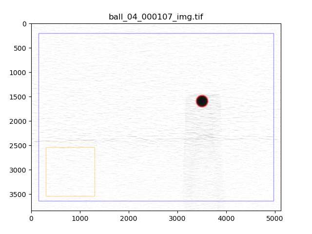
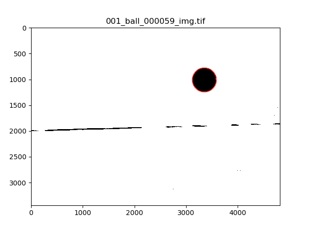
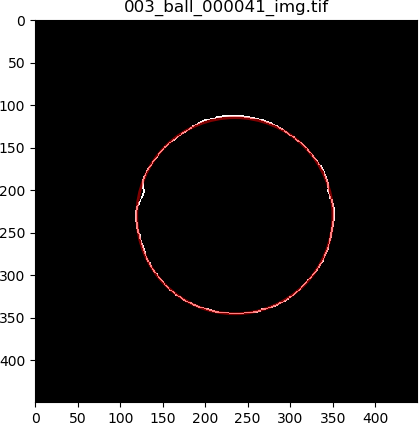
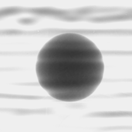
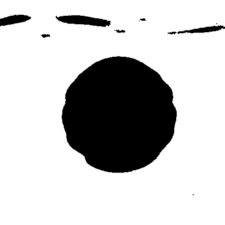
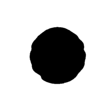
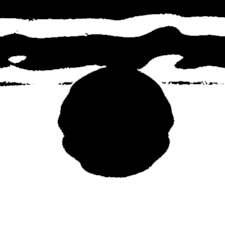
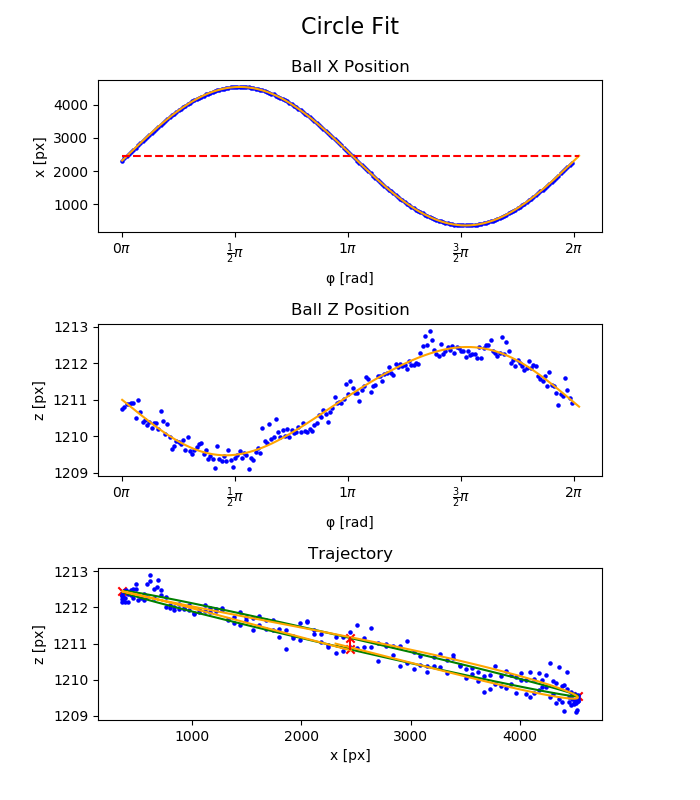

# BallTracker Ver. 1.2

Tracks a ball to calibrate an axis. For parallel beam geometries.

This software was created at Helmholtz-Zentrum Geesthacht, Zentrum für Material- und Küstenforschung (HZG) and turned into a collaboration with Bundesanstalt für Materialforschung und -prüfung (BAM).

## Axis Calibration using a Circular Ball Trajectory

Our intention is to find the axis tilt around the x and y axes and potentially the wobble of the rotation axis by tracking the trajectory of a small steel ball (300µm diameter) around the rotation axis within a complete CT scan of one or more rotations.

## Recommended procedure for a ball scan

+ At least one full rotation.
+ 50+ projection images per rotation.
+ Ball should travel almost the full detector width, but not get too close to the edges.
+ Dark and reference images at the beginning (just a few).

## Getting the Ball Tracker ready

### Preparing a Python 3 environment with the necessary packages

The ball tracker needs a Python 3 environment with the following libraries and packages: _scipy, scikit-image, numpy, matplotlib_. Anaconda will bring most of the packages that are needed, and it should not be necessary to install any packages. Anyway, this is how to create an environment called _balltracker_ with the necessary packages:

	conda create -n balltracker python=3
	conda activate balltracker
	pip install scipy scikit-image numpy matplotlib

Once installed, you can always re-activate this environment after logging in:

	conda activate balltracker

All the ball tracker files are stored in the folder _balltracker_, which can be called from Python as a module. Additionally, you need a control script (there is an example in _example_run.py_) that is used to configure the tracker and run it.

## Configuration

Open the control script to set up the configuration. Here are a few hints.

### Name, Directories and Output Files

The **name** is used as a prefix for output files, such as the results of the fits.

	name = "003_ball"

In the next step, we define the input files (i.e. projections containing the ball), flat fields and dark fields. If no dark/flat field correction shall take place, you can set the respective parameters to `None`.

	inputFiles = ImageStack(filePattern="example_projections/003_ball_%6d_img.tif")
	flatFields = ImageStack(filePattern="example_projections/003_ball_%6d_ref.tif")
	darkFields = ImageStack(filePattern="example_projections/003_ball_%6d_dar.tif")
	outputFolder = "results"

The `ImageStack()` constructor function accepts the following parameters (in this order, if arguments are not passed by name).
+ `filePattern` (Required.) Name of a single file or a numbered file stack. If file names end on `.tif` or `.tiff`, those are assumed to be TIFF files.
+ `width` (Required for RAW input.) Image width (in pixels) of a raw file or chunk.
+ `height` (Required for RAW input.) Image height (in pixels) of a raw file or chunk.
+ `dataType` (Required for RAW input, optional for TIFF or RAW output.) Data type of the grey value representation. Options are: `"int8"`, `"int16"`, `"int32"`, `"int64"`, `"uint8"`, `"uint16"`, `"uint32"`, `"uint64"`, `"float32"`, and `"float64"`.
+ `byteOrder` (Optional for RAW.) Byte order (endianness) of the raw data.\\Default: system default. Options are: `"little"` and `"big"`.
+ `rawFileHeaderSize` (Optional.) File header size (in bytes) of an input RAW file. Default: 0.
+ `rawImageHeaderSize` (Optional.) Image header size (in bytes) for each image in an input RAW chunk that contains several image slices. Default: 0.
+ `slices` (Optional.) Number of image slices to be read from a given input RAW file, or number of image files to be read from a given image sequence. Default: the number of slices will be determined automatically from the RAW chunk file size or from the number of images in the provided sequence.
+ `startNumber` (Optional, for image sequences.) The index in the sequential number in the input filename where to start reading files for this stack.
+ `flipByteOrder` (Optional, only for TIFF input.) The byte order (big or little endian) should be determined by the TIFF loader and be imported correctly. If not, you can use this parameter to flip the byte order after reading a TIFF file.

For TIFF files, the data type and byte order is determined from the header information when reading existing files.

The functions that write result files require an argument that tells if the written files should contain additional information in their file names, such as median, skipped files and bin size. This parameter is defined here to pass it on to the write functions at the end of the script.

	infosInFilename = True

### Ball Sequence

The ball tracker provides a helper class called _ballSequence_ that will run the tracker and the analysis for us. But first, it needs to know what to do. Here, we create an object from this class, and will use this _seq_ object in the following to configure and run the tracker. The first arguments it takes are the input and flat field correction file names:

	seq = ballSequence(inputFileStack=inputFiles, outputFolder=outputFolder, darkFileStack=darkFields, flatFileStack=flatFields)

### Basics

#### Axis designations

By default, the following axis designations are used in all output and evaluation files:

+ `"x"` for the detector's row axis (horizontal stage axis),
+ `"y"` for the detector's column axis (vertical stage axis / rotation axis),
+ `"z"` for the principal beam axis.

To change these designations to match your setup, call the following functions on your `ballSequence` object:

	seq.setRowAxis("x")
	seq.setColAxis("y")
	seq.setBeamAxis("z")

#### Scan angle

The angular position for each projection is calculated from the full rotation angle given here. This is the angle covered during the CT scan, i.e. 360° for one full rotation, or 1440° for a scan of four rotations.

	seq.setScanAngle(1440)

#### Skipping projections

You can skip projections to speed up the tracking. In this case, only every n-th projection is taken into account. 1 means all projections, 2 means every second, and so on.

	seq.skip(1)

#### Saving intermediate pictures

If you want to see what the tracker is actually doing when it manipulates the projections, you can activate the output of intermediate steps. This will create a folder for each processing step in the output directory, and store the intermediate picture for each projection in these folders.

	seq.saveIntermediates(True)

### Display mode

You can activate graphics output during the tracking. So far, this only works if multiprocessing is deactivated. If multiprocessing is used, the graphics output will be deactivated automatically.

__Absorption mode__ will show the absorption picture (dark/ref corrected), draw the detected circle in red, the cropping region in blue, and the shift observation region in yellow.

	seq.displayMode(mode='absorption')

__Threshold mode__ will show the (cropped, binned) projections after thresholding. If the ball was found, a red circle will appear around it.

	seq.displayMode(mode='threshold') 

__Edges mode__ will show the projections after running the edge filter. If the ball was found, a red circle will appear around it.

	seq.displayMode(mode='edges') 

__No interactive display output:__ set the display mode to `'none'` if you don't want any graphics output during the tracking. Matplotlib will still be used to plot and display the results.

	seq.displayMode(mode='none') 

#### Deactivating X graphics output completely

If you don't want any image or plot windows popping up, set the display mode to `'none'` as shown above, and also give matplotlib a non-visible backend such as Agg. This will limit matplotlib to save PNGs of the result plots and not display those in windows. For example, you need to do this if you work via SSH with no X forwarding.

Do this before importing anything from `balltracker`:

	import matplotlib
	matplotlib.use('Agg')

### Multiprocessing

You can split the ball tracking into parallel processes, where each process runs independently and processes only one projection and then returns the results. Python will automatically handle the number of active threads in such a way that it doesn't exceed the number of available CPU cores. However, it might be a good idea to limit the number of concurrently active processes, so the tracker won't use too many resources, especially memory and network bandwidth. _More processes_ does not always mean _faster_ ;-)

	seq.multiprocessing(True)
	seq.numberOfProcesses(n=6)

Graphics output will be deactivated during the tracking. Only the result plots will be shown in the end.

### Image preprocessing

#### Applying dark and reference images

Dark and reference correction can be activated independently from each other. If multiple dark or reference images are provided, they will be averaged before being applied to the projections.

	seq.applyDarks(True)
	seq.applyRefs(True)

#### Processing steps

The following function calls set the parameters for the image processing steps before a circle is fit to the image.

| 1. Median Filter | 2. Threshold Binarization | 3. Patch Cleanup | 4. Edge Filter |
|:----------------:|:-------------------------:|:----------------:|:--------------:|
|  |  |  |  |

#### Median filter

	seq.median(3)

This sets the size of the square box window for the median filter that will be applied to the projection images. Useful to get rid of defect pixels.

#### Threshold binarization

It is necessary to convert the image into a binary black/white image before running an edge detection filter. A threshold must be defined to separate black and white. There are two possible ways to do this.

+ Choose a **min/max ratio:** the threshold will be placed at a fraction of the distance between lowest and highest gray value in the picture. This fraction is given by the ratio. A ratio of 0.7 means that the threshold will be at 70% of the distance between lowest and highest gray value.

		seq.threshold(ratio=0.7, absolute=None)

+ Or choose an **absolute gray value** for the threshold:

		seq.threshold(ratio=None, absolute=45000)

One of the two parameters for this function must be set to None, so that the function knows which method should be applied.

#### Patch cleanup

Ideally, only the ball remains as a black, filled circle after the thresholding procedure. However, other patches of black areas may still be present in the image and should be cleared before applying the edge filter and the circle fitting. The patch cleanup will identify all independent patches and remove them if at least one of the two following criteria is met:

+ The number of pixels in the patch is too small or too large for the expected ball.
+ The aspect ratio of the patch is too far from circle-like. An ideal circle should have an aspect ratio of width/height = 1.

You can tune the patch cleanup depending on which values you expect:

	seq.patchCleanup(doCleanUp=True,
	                 min_circle_area=(150*150),
	                 max_patch_area=None,
	                 aspect_ratio_tolerance=0.15)

In this example, the area of a circle must contain at least 150 * 150 pixels, and no maximum number of pixels is set. Also, the aspect ratio of a patch must not deviate by more than 0.15 around the ideal aspect ratio of 1.

#### Edge filter

The circle will only be fit to the edge of the ball, so we need to run an edge filter as the last pre-processing step. Two choices are available: a Canny filter and a Sobel filter.

1. **Canny Filter**

		seq.edgeDetection('canny')

	Canny gives a cleaner, thinner edge, but the algorithm is slower than Sobel.

	

2. **Sobel Filter**

		seq.edgeDetection('sobel')

	Sobel is faster, but usually only works in one spatial direction. Therefore, the results from applying it in x direction and in y direction are combined to create  a more complete edge. This results in a thicker edge line.

	

### Data reduction

#### Cropping

Cropping reduces the processing time significantly.

You can define a crop area by providing the upper left corner (x0, y0) and the bottom right corner (x1, y1) of a crop rectangle:

	seq.crop(x0=100, y0=1000, x1=5000, y1=2000)

You can also define a border that should be cropped off around the picture. In this case, you don't need to know the actual image size. Rather, you define the offset for the crop box from the top, bottom, left and right edges of the image:

	seq.cropBorder(top=200, bottom=200, left=80, right=80)

In addition to the crops above, you can also apply an **automatic crop.** This autocrop is done one the cropped image (if any of the previous two methods is defined) or on the uncropped image.

The autocrop strongly bins the projection image (with a bin size of 40), and assumes that the gray value minimum in this strongly binned image represents the ball. The absorption image is then cropped around this minimum, in the shape of a square with a side length given by the `autoCropSize`:

	seq.autoCrop(doAutoCrop=True, autoCropSize=900)

In this example, the images are cropped to squares of 900×900 pixels, (hopefully) containing the ball.

#### Binning

You can also set a bin size. 1=no binning.

	seq.binning(2)

A low bin size, such as 2, will speed up the ball tracking without losing too much precision.

#### Drift compensation

If the background drifts too much, the reference images cannot be applied correctly. In this case, the results can be improved by shifting the reference image such that it matches the projection image. This takes a lot of computation time, so it is a good idea to define a ROI that is observed for background shifts. The ball should not cross this ROI, but it may lie outside of the cropped region, because the drift compensation is done before cropping.

You can choose if you want to run a drift correction before each projection is handled (`refsToImg`).

The position of the drift ROI is given by its distance from the top or bottom border, as well as from left or right border. In each case, choose one: (top or bottom), and (left or right). Also, you must set the desired width and height of the drift observation ROI. The bigger this ROI, the more computation time is needed.

	seq.driftCompensation(refsToImg=True)
	seq.driftROI(bottom=300, left=300, width=1000, height=1000)

### Ball detection

There are two methods to find the center and the radius of the ball.

1.  **Circle Fit**

	A circle function is fit to the points that remain after the edge filter is applied. For this method, the linear least squares method is used that is described in:
	[I. D. Coope: Circle Fitting by Linear and Nonlinear Least Squares](https://doi.org/10.1007/BF00939613)

	This method will always run when running the tracker. The mean deviation and the maximum deviation of all the points is calculated, and they must be within the tolerances that you defined:

		seq.circleFitTolerances(max_meanDeviation=5, max_maxDeviation=30)

	In this example, the mean deviation of all points from the circular fit should not be more than 5 pixels, and the maximum deviation of any single point must not be more than 30 pixels. These parameters always refer to the unbinned image and are adapted internally if binning is applied.

2. **Intensity Profile Fit**

	In addition to the circle fit described above, you can also fit the intensity profile of the ball to find its center and radius. This intensity profile is given by the Beer-Lambert law for an absorbing ball:

	

	This method uses the median-filtered image and leads to much noisier results than the circle fit, but gives an alternative way to validate the results obtained from the main processing pipeline of thresholding, patch cleaning, edge filtering and circle fitting.

	The additional intensity fit can be turned on using

		seq.fitIntensityProfile(True)

	When saving the results, two files with the ball positions will be created, and the results file will contain a section for the circle fit as well as a section for the intensity profile fit.

## Running the Ball Tracker

Once your configuration is complete, you can run the ball tracker by calling this function:

	seq.trackBall()

When the tracker handles the projection files, typical output lines will look like this:

	002_ball_000124_img.tif  1/10 patches,  mean/max: 11.820 57.781  X
	002_ball_000125_img.tif  1/8  patches,  mean/max:  3.960 15.719  OK
	002_ball_000130_img.tif  0/15 patches,  X

The **first column** gives the file name.

The **second column** gives the number of patches that remained after the patch cleanup, as well as the total number of patches before the cleanup. There must always be exactly one remaining patch, otherwise the image will be rejected.

The **third column** shows the mean deviation of the circle points from the fitted circle function, and the maximum deviation of any point from the fit. Both must be within the tolerances that you have set in your configuration, or the results will be rejected.

The **fourth column** says OK if the circle has been accepted, and X if it has been rejected.

Of the three examples above, the first one has been rejected because the deviations from the circle fit are too big. The second one has been accepted: only one patch remained after the cleanup, and the deviations are within the tolerances. The third one has been rejected because of the 15 patches that remained after thresholding, none were sufficiently circle-like. We can easily understand these results by looking at the thresholded images:

| X                | OK                        | X                |
|:----------------:|:-------------------------:|:----------------:|
|  |  |  |
| The ball is still connected with  background artifacts, but the whole patch is still sufficiently circle-like. It is accepted by the patch cleanup, but rejected because the remaining points after the edge detection deviate too much from the circular fit. | The ball is accepted because the patches from the background could all be removed successfully, and the deviations of the remaining ball edge from the circle fit are still within the tolerance. | No ball-shaped patch can be identified during the cleanup. The ball patch is connected with a background patch, resulting in a wrong aspect ratio (and, if defined, also a patch size that is too big.) |

In all of these cases, a higher threshold ratio could improve the results.

After a successful tracker run, you can save a file with the configuration parameters in the output folder:

	seq.saveParameters(name=name, infosInFilename=infosInFilename)

The suffix _parameters_ will automatically be added to the file name.

You can also save a list of the detected ball positions and radii in the output folder:

	seq.saveCoordinates(name=name, infosInFilename=infosInFilename)

This will create a file for the coordinates from the circle fit, and another file for the coordinates from the intensity profile fit (if activated).

Instead of running the ball tracker and saving the results, previous coordinate files can also be imported, both for the circle fit or the intensity profile fit:

	seq.importCoordinates(name=name, specifier="coordinates_circleFit", infosInFilename=infosInFilename)
	seq.importCoordinates(name=name, specifier="coordinates_intensityFit", infosInFilename=infosInFilename)

## Trajectory Fit and Axis Tilt

### Running the trajectory analysis

The trajectory analysis can be started with the following function call:

	seq.calcAxisParameters(fitSecondOrderWave=True)

This function will fit one or two waves to the x and z coordinates of the ball's trajectory. For an ideal circular trajectory, one sine wave is sufficient:

However, under certain circumstances (such as a frequency wobble, see below), other frequencies can be part of the x and y trajectory. For these cases, the parameter `fitSecondOrderWave` should be set to `True`. This will fit an additional wave with a variable frequency ω.

In both cases, the two axis tilts will be calculated just from the first component (frequency 1), but the second method can help separating the two components.

The **Y tilt** is then calculated from the slope of the outermost points in x direction, where the rotation axis reaches +π/2 and -π/2:

Using an iteration loop, the maximum expansion of the visible trajectory is then found. This overall width is the radius _R_ of the ball's circular trajectory. The **X tilt** can then be calculated from the vertical separation of the trajectory's points at 0° and 180°, respectively:

After getting these tilt parameters, we can look at the finer oscillations of the Z component that can be caused by a wobble. The next sections describe how this works. The result so far will appear in a Matplotlib window and will be written to the result folder as a PNG image:

Blue dots represent the results for the ball centers determined by the circle fit (or intensity fit, if activated). In the two upper subgraphs, the orange lines show the fit function (either 1st or 2nd order sine waves). The dashed red line in the upper subgraph displays the location of the calculated rotation axis. In the bottom graph, the orange line displays the trajectory calculated only from the 1st order part of the fit function (i.e. the sine wave with a frequency of the stage rotation frequency). If second order wave fitting is activated, the dark green line displays the trajectory calculated from the complete fit function (1st and 2nd order components). For intensity fit plots, orange lines are replaced by gray lines for better distinction. Their meaning remains the same.

### Theory and Simulations

#### Ideal Trajectory

In the ideal case, the ball follows a circular trajectory at height _L_ above the ground, around the axis of rotation (z) at a distance of _R_ to the rotation center.

In the projection images, the ball will appear to move back and forth on a horizontal line, with its X positions corresponding to the angle of rotation φ.

#### Y Tilt

If the rotation axis has a constant tilt β around the setup's Y axis, the Z component of the ball coordinates can also oscillate around the center of rotation.

In this case, the trajectory will follow a sloped line on the detector. The x and z position are in phase for negative β, or shifted by 180° for positive β.

#### X Tilt

The rotation axis can also have a tilt α around the system's X axis, which will lead to a phase shift between the x and the z component of ±90°, depending on whether the tilt angle α is positive or negative.

#### Tilt around X and Y

A rotation around two axes is not trivial, because the result depends on which rotation is done first. However, for small angles of rotation α and β, we can use the first order Taylor expansions sin(x)=x and cos(x)=1, as well as the approximation α·β=0. In this case, the two possible transformations lead to approximately the same result:

For the following simulation plots, the rotation around the X axis is done before the roation around the Y axis.

#### Constant Wobble

A simple wobble can be simulated with an axis tilt that depends on the rotation angle φ. This leads to a center of rotation that itself moves on a circular trajectory:

#### Frequency Wobble

If the wobble of the rotation axis also has its own frequency and describes a nutation, this will have an effect on the sample's Z position.

For a wobble frequency of 2, the result looks like this:

The shape of these plots **strongly depends on the phase φ0** of the sample compared to the phase of the center of rotation. In the following animation, this phase shift is contiuously changed and the results are shown:

#### Runout

A runout is a translational shift of the rotation axis, as a function of the rotation angle φ.

The following picture shows a runout in x direction at a frequency of 1 (one runout cycle per rotation).

Any additional runout in y direction does not change the results that are visible through the detector:

#### Overall Transformation and Wobble Fit

For the simulations above, the transformation matrices have been chained in the following way:

The **wobble angle γ** can have a constant component (i.e. a constant tilt rotating with frequency 1) as well as a dynamic component, a nutation oscillating as a function of the rotation angle φ:

For small tilt angles α and β, and for small wobble angles γ, the overall transformation can be simplified using only the first components of the Taylor expansions  of the trigonometric functions:

The Z component of the tilted sample vector is used to find the wobble parameters. This function can be fitted to the tracked Z positions to get values for the wobble amplitude Ω, the wobble frequency ω and the wobble phase ω0.

For simplicity, the radius _R_ is kept constant during the fitting procedure, and the constant wobble tilt is neglected: γ0 = 0. The tilt angles α and β are also kept constant at the values that have been found in analysing the trajectory ellipse as seen from the detector.